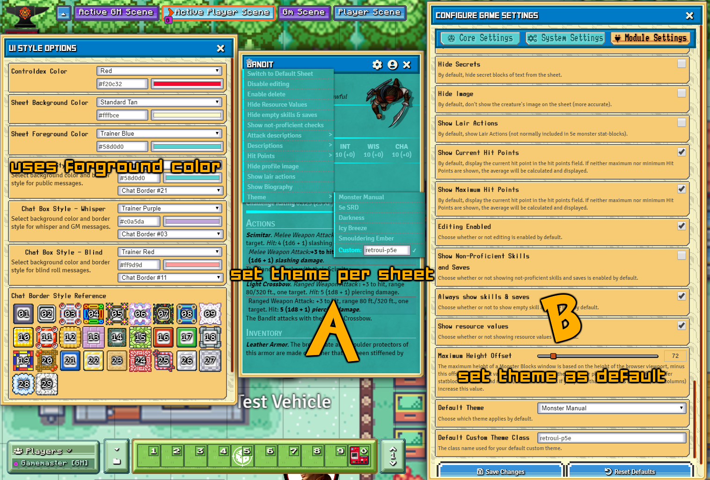
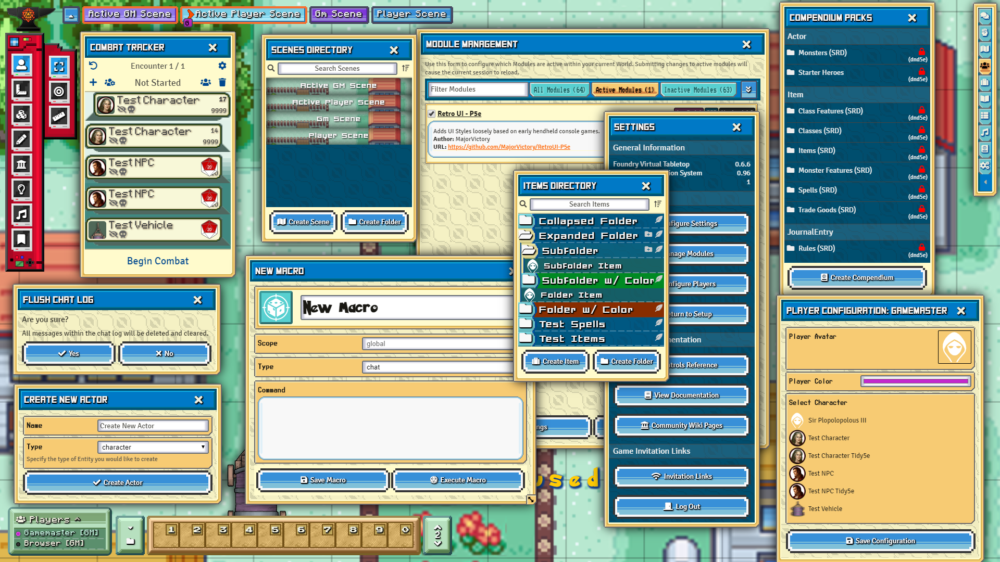

[![foundry-shield]][foundry-url]
[![Forks][forks-shield]][forks-url]
[![Stargazers][stars-shield]][stars-url]
[![Issues][issues-shield]][issues-url]

 

  <h3 align="center">Retro UI (P5e) - UI overhaul module for FoundryVtt</h3>
  

    A module for FoundryVtt that overhauls the UI with a customizable style themed after early handheld console games.
     
     
    <a href="https://github.com/MajorVictory/RetroUI-P5e/issues">Report Bug / Request Feature</a>
  

## Installation

### Requirements

**[Core Compatibility]**:
 * *FoundryVTT* 0.6.5-0.6.6  

**[Systems Compatibility]**:
 * *dnd5e* 0.95-0.96

**[Required Modules]**
 * None

**[Specific Module Compatibility]**
 * dnd5e - Alt5eSheet
 * dnd5e - Tidy5eSheet
 * itemcollection
 * The Furnace
 * Monsterblock
 * [Request More](https://github.com/MajorVictory/RetroUI-P5e/issues)

**[Known Issues]**
 * *Unknown Compatibility* with game specific sheets and dialogs

### Latest Release

You can download the module in it's current state by pasting the following manifest url into Foundry.

> https://raw.githubusercontent.com/MajorVictory/RetroUI-P5e/master/module.json

## Changelog

[Previous Versions Changelog](CHANGELOG.md)

## Screenshots 

### Character sheets

Monsterblock

Tidy5eSheet

### Customizable Colors

### All Vanilla Menus and Dialogs 

## License

Retro UI (P5e) is a module for Foundry VTT by Majorvictory and is licensed under a [Creative Commons Attribution 4.0 International License](http://creativecommons.org/licenses/by/4.0/).

This work is licensed under Foundry Virtual Tabletop [EULA - Limited License Agreement for module development from May 29, 2020](https://foundryvtt.com/article/license/).

[foundry-shield]: https://img.shields.io/badge/Foundry-v0.6.6-informational
[foundry-url]: https://foundryvtt.com/
[forks-shield]: https://img.shields.io/github/forks/MajorVictory/RetroUI-P5e.svg?style=flat-square
[forks-url]: https://github.com/MajorVictory/RetroUI-P5e/network/members
[stars-shield]: https://img.shields.io/github/stars/MajorVictory/RetroUI-P5e.svg?style=flat-square
[stars-url]: https://github.com/MajorVictory/RetroUI-P5e/stargazers
[issues-shield]: https://img.shields.io/github/issues/MajorVictory/RetroUI-P5e.svg?style=flat-square
[issues-url]: https://github.com/MajorVictory/RetroUI-P5e/issues